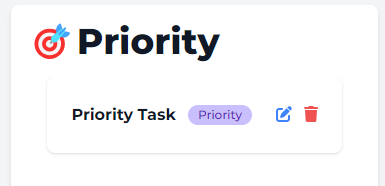

# Bucket

_Bucket_ is designed to help you organize your tasks efficiently by allowing you to categorize them, manage them effortlessly, and prioritize your daily activities.

---

## Tech Stack

- Ruby on Rails: Full-stack framework with Ruby language
- TailwindCSS: Utility-first CSS Framework
- Render: Web service deployment
- PostgreSQL: Database

---

## Getting Started

### 1. Sign Up:

- If you're a new user, you need to sign up for an account. Provide your email address, choose a secure password, and create your account.
  

### 2.Login:

- If you already have an account, simply log in using your email address and password.
  \_

### 3. Root Page:

- Upon successful login, you'll be directed to the root page of the app.
- Here, you'll see a list of categories along with an "Create Bucket" button.
- On the right side, there's a container displaying the list of priorities for today.
  

### 4. Adding a Category/Bucket:

- Click on the "Create Bucket" button.
- You'll be taken to the add category page where you can enter the details of the new category.
- After creating the category, you'll be redirected back to the root page.
  

### 5. Editing a Category/Bucket:

- From the categories page, you can also edit existing categories/buckets.
- After making changes, you'll be redirected back to the categories page.
  

### 6. Viewing Category/Bucket Details:

- Click on a category/bucket title from the categories page to view all its details.
  

### 7. Adding a Task to a Category:

- From the category/bucket page, click on the "Add Task" button.
- You'll be directed to the add task page where you can input task details.
- After adding a task, you'll be redirected back to the category page.
  

### 8. Updating a Task:

- To modify a task, either go to the task's details page or directly click the edit icon next to the task title.
- Here, you can edit the task details, including its status (pending or completed) and priority.
- After updating the task, you'll be redirected back to the category page.
  

### 9. Viewing Priorities:

- After updating a task's priority, you'll be redirected to the categories page.
- The priorities container on the right side will reflect the changes made.
  

### 10. Viewing Task Details:

- From the category page, click on a task to view all its details.
  
